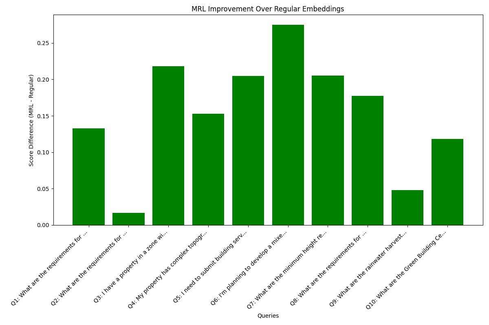

# Embedding Comparison Report

## Test Queries Used

1. What are the requirements for temporary buildings?
2. What are the requirements for advertising boards and hoardings?
3. I have a property in a zone with factor 3.75 that falls within multiple development planning areas. How is the applicable zoning factor determined, and which Development Plan takes precedence?
4. My property has complex topography with elevation changes of over 15 meters from front to back. How should I calculate building height, and what special considerations apply to stepped-design buildings on sloped sites?
5. I need to submit building services engineering designs for a complex mixed-use development with innovative HVAC and energy systems. What specific documentation is required beyond standard submissions?
6. I'm planning to develop a mixed-use project in phases over 5-7 years. What specific considerations apply to phased development permits, and how should infrastructure development be coordinated across phases?
7. What are the minimum height requirements for rooms in residential buildings?
8. What are the requirements for vertical transportation systems in buildings?
9. What are the rainwater harvesting requirements for buildings in Sri Lanka?
10. What are the Green Building Certification requirements in Sri Lanka?

## Memory Usage Comparison

| Model | Dimension | Size (MB) |
|-------|-----------|----------:|
| Regular | full | 0.79 |
| MRL | 768 | 0.79 |
| MRL | 512 | 0.79 |
| MRL | 256 | 0.53 |
| MRL | 128 | 0.26 |
| MRL | 64 | 0.13 |

## Search Speed Comparison

| Model | Dimension | Avg. Search Time (s) |
|-------|-----------|---------------------:|
| Regular | full | 0.0389 |
| MRL | 768 | 0.0074 |
| MRL | 512 | 0.0080 |
| MRL | 256 | 0.0081 |
| MRL | 128 | 0.0075 |
| MRL | 64 | 0.0070 |

## Sample Retrieval Results

### Query: "What are the requirements for temporary buildings?"

#### Regular Embeddings

1. **Score: 0.2193**
   Source: cleaned.txt
   Excerpt: Temporary Building shall be granted by the Relevant Authority with or without
conditions and shall be valid for such period of time or not more than o...

2. **Score: 0.3217**
   Source: cleaned.txt
   Excerpt: mbing, escalators/ lifts,
lightning protection, Ventilation, Air-conditioning, heating, sewer systems, drainage, fire protection,
communication and ne...

3. **Score: 0.3756**
   Source: cleaned.txt
   Excerpt: ity.
(4) The Relevant Authority may permit a Temporary Building which facilitates the commencement or continuation
of building works, for a particular...

#### MRL Embeddings (256d)

1. **Score: 0.2522**
   Source: cleaned.txt
   Excerpt: Temporary Building shall be granted by the Relevant Authority with or without
conditions and shall be valid for such period of time or not more than o...

2. **Score: 0.4991**
   Source: cleaned.txt
   Excerpt: ity.
(4) The Relevant Authority may permit a Temporary Building which facilitates the commencement or continuation
of building works, for a particular...

3. **Score: 0.5635**
   Source: cleaned.txt
   Excerpt: g street, to show its future width or to show
the width of a future street as sanctioned by the Local Authority.
“Temporary Building” means a building...

### Query: "What are the requirements for advertising boards and hoardings?"

#### Regular Embeddings

1. **Score: 0.5619**
   Source: cleaned.txt
   Excerpt: s or notices may be permitted for a limited period of time for special commercial
events, cultural or religious festivals or any other special occasio...

2. **Score: 0.5632**
   Source: cleaned.txt
   Excerpt: nvironmental values of the
place, identity and the architectural character of the location and its surroundings.
(7) The permission shall not be grant...

3. **Score: 0.5984**
   Source: cleaned.txt
   Excerpt: over more than 25% of the frontage of such building.
(12) No advertisement, billboard or hoarding etc. shall be erected or displayed with the support ...

#### MRL Embeddings (256d)

1. **Score: 0.5621**
   Source: cleaned.txt
   Excerpt: lated
activities.
Digital Advertising boards (per m2.)
Rs. 5000 /-
Non Digital Advertising boards (per
m2)
Rs. 3000 /-
Name Boards
(Per m2)
Rs. 1000/-...

2. **Score: 0.5923**
   Source: cleaned.txt
   Excerpt: illboard or hoarding etc. shall be erected, maintained and displayed in a manner that disturb
the vehicular movements and likely to misguide the users...

3. **Score: 0.6197**
   Source: cleaned.txt
   Excerpt: s or notices may be permitted for a limited period of time for special commercial
events, cultural or religious festivals or any other special occasio...

### Query: "I have a property in a zone with factor 3.75 that falls within multiple development planning areas. How is the applicable zoning factor determined, and which Development Plan takes precedence?"

#### Regular Embeddings

1. **Score: 0.2483**
   Source: cleaned.txt
   Excerpt: late the form of the physical environment and distribution of the development density as
envisaged in the development plan. Zone Factor is computed as...

2. **Score: 0.3778**
   Source: tables-page-119-table-1.csv
   Excerpt: Table: tables-page-119-table-1
 Land extent (Sq.M) Zone factor = 3.50-3.74 Unnamed: 2 Unnamed: 3   Unnamed: 4 Zone factor = 3.75-4.00 Unnamed: 6 Unnam...

3. **Score: 0.3799**
   Source: cleaned.txt
   Excerpt:  Form A - Permissible Floor Area Ratio
3. 5
3. 3
3. 2
3. 1
3. 0
2. 9
2. 7
2. 0
2. 2
2. 3
2. 4
2. 6
**
6m
4. 5
4. 3
4. 0
3. 8
3. 5
3. 4
3. 1
2. 2
2. 7
...

#### MRL Embeddings (256d)

1. **Score: 0.4402**
   Source: cleaned.txt
   Excerpt: late the form of the physical environment and distribution of the development density as
envisaged in the development plan. Zone Factor is computed as...

2. **Score: 0.5627**
   Source: cleaned.txt
   Excerpt: he area having zoning factor based development plans
Schedule 6
9m
2. 6
3. 2
3. 3
3. 4
3. 6
3. 8
4. 0
4. 2
4. 4
4. 6
4. 8
5. 0
2. 4
2. 6
2. 7
2. 8
3....

3. **Score: 0.6579**
   Source: cleaned.txt
   Excerpt:  Form A - Permissible Floor Area Ratio
3. 5
3. 3
3. 2
3. 1
3. 0
2. 9
2. 7
2. 0
2. 2
2. 3
2. 4
2. 6
**
6m
4. 5
4. 3
4. 0
3. 8
3. 5
3. 4
3. 1
2. 2
2. 7
...

### Query: "My property has complex topography with elevation changes of over 15 meters from front to back. How should I calculate building height, and what special considerations apply to stepped-design buildings on sloped sites?"

#### Regular Embeddings

1. **Score: 0.3141**
   Source: cleaned.txt
   Excerpt: e elevations of the building shall be drawn including the details stipulated hereunder:
(1) all the External Walls, external columns, parapet walls an...

2. **Score: 0.3342**
   Source: cleaned.txt
   Excerpt: e maximum
slope is less than 10 degrees
32. All building floor plans, sections and elevations shall be drawn as per the scale specified for each drawi...

3. **Score: 0.3986**
   Source: cleaned.txt
   Excerpt: thereto;
(4) dimensions in figures of the doors, windows or ventilation openings, the heights of every floor, the ceiling
heights and the Ground Floor...

#### MRL Embeddings (256d)

1. **Score: 0.4913**
   Source: cleaned.txt
   Excerpt: e elevations of the building shall be drawn including the details stipulated hereunder:
(1) all the External Walls, external columns, parapet walls an...

2. **Score: 0.4986**
   Source: cleaned.txt
   Excerpt: e maximum
slope is less than 10 degrees
32. All building floor plans, sections and elevations shall be drawn as per the scale specified for each drawi...

3. **Score: 0.5149**
   Source: cleaned.txt
   Excerpt: thereto;
(4) dimensions in figures of the doors, windows or ventilation openings, the heights of every floor, the ceiling
heights and the Ground Floor...

### Query: "I need to submit building services engineering designs for a complex mixed-use development with innovative HVAC and energy systems. What specific documentation is required beyond standard submissions?"

#### Regular Embeddings

1. **Score: 0.3522**
   Source: cleaned.txt
   Excerpt:  deemed necessary by the Relevant Authority, such designs in the
form of plans and sections, together with a copy of the design brief prepared and cer...

2. **Score: 0.3696**
   Source: cleaned.txt
   Excerpt: inery which is to be used for piling work, if
applicable.
DESIGNS FOR BUILDING SERVICES
40. (1) A building, where the floor area is 500m2 or more, or ...

3. **Score: 0.3933**
   Source: cleaned.txt
   Excerpt: mbing, escalators/ lifts,
lightning protection, Ventilation, Air-conditioning, heating, sewer systems, drainage, fire protection,
communication and ne...

#### MRL Embeddings (256d)

1. **Score: 0.5069**
   Source: cleaned.txt
   Excerpt:  deemed necessary by the Relevant Authority, such designs in the
form of plans and sections, together with a copy of the design brief prepared and cer...

2. **Score: 0.5471**
   Source: cleaned.txt
   Excerpt: inery which is to be used for piling work, if
applicable.
DESIGNS FOR BUILDING SERVICES
40. (1) A building, where the floor area is 500m2 or more, or ...

3. **Score: 0.6760**
   Source: cleaned.txt
   Excerpt: htning protection, Ventilation, Air-conditioning, heating, sewer
systems, drainage, rain water harvesting systems, fire protection, communication and ...

### Query: "I'm planning to develop a mixed-use project in phases over 5-7 years. What specific considerations apply to phased development permits, and how should infrastructure development be coordinated across phases?"

#### Regular Embeddings

1. **Score: 0.5561**
   Source: cleaned.txt
   Excerpt: ure that all conditions specified in the Development Permit issued for the
development are fulfilled prior to applying for the CoC.
(2) Such applicati...

2. **Score: 0.5645**
   Source: cleaned.txt
   Excerpt: any physical development of the site or any part thereof, violating the
terms and conditions of the Development Permit issued in respect to that site ...

3. **Score: 0.5784**
   Source: cleaned.txt
   Excerpt: ayout plan.
² Examine the compliance of proposed
development with the Planning and
Development regulations.
² Assessment on compatibility with the
env...

#### MRL Embeddings (256d)

1. **Score: 0.8055**
   Source: cleaned.txt
   Excerpt: ure that all conditions specified in the Development Permit issued for the
development are fulfilled prior to applying for the CoC.
(2) Such applicati...

2. **Score: 0.8559**
   Source: cleaned.txt
   Excerpt: lan and Development Permit.
iv. submit certificates for fire services, electricity, water supply, sewage or wastewater disposal and
solid waste manage...

3. **Score: 0.8627**
   Source: cleaned.txt
   Excerpt: ayout plan.
² Examine the compliance of proposed
development with the Planning and
Development regulations.
² Assessment on compatibility with the
env...

### Query: "What are the minimum height requirements for rooms in residential buildings?"

#### Regular Embeddings

1. **Score: 0.2033**
   Source: cleaned.txt
   Excerpt: land is less than 6.0 m.
67. (1)
The minimum height of a room in a residential building shall:
a. not be less than 2.8 m in average and have minimum o...

2. **Score: 0.2451**
   Source: cleaned.txt
   Excerpt: west point.
(5) The height of a room in a Factory shall not be less than 3.5 m in average and minimum of 2.8 m at the lowest
point.
(6) a. In a buildi...

3. **Score: 0.2842**
   Source: cleaned.txt
   Excerpt: constructed in accordance with these regulations and other conditions imposed by the Relevant
Authority.
(8) Notwithstanding the provisions of the Reg...

#### MRL Embeddings (256d)

1. **Score: 0.4294**
   Source: cleaned.txt
   Excerpt: west point.
(5) The height of a room in a Factory shall not be less than 3.5 m in average and minimum of 2.8 m at the lowest
point.
(6) a. In a buildi...

2. **Score: 0.4444**
   Source: cleaned.txt
   Excerpt: land is less than 6.0 m.
67. (1)
The minimum height of a room in a residential building shall:
a. not be less than 2.8 m in average and have minimum o...

3. **Score: 0.4742**
   Source: cleaned.txt
   Excerpt: constructed in accordance with these regulations and other conditions imposed by the Relevant
Authority.
(8) Notwithstanding the provisions of the Reg...

### Query: "What are the requirements for vertical transportation systems in buildings?"

#### Regular Embeddings

1. **Score: 0.1800**
   Source: cleaned.txt
   Excerpt: ot less than 1.1 m.
69. (1) A vertical transportation system shall be designed and installed for buildings exceeding four floors or more than
15. 0 m ...

2. **Score: 0.4028**
   Source: cleaned.txt
   Excerpt: light bulbs, fans and similler elements
68. (1)
The minimum width of the stairs and the minimum dimensions of treads and risers shall be in conformity...

3. **Score: 0.4496**
   Source: cleaned.txt
   Excerpt: mbing, escalators/ lifts,
lightning protection, Ventilation, Air-conditioning, heating, sewer systems, drainage, fire protection,
communication and ne...

#### MRL Embeddings (256d)

1. **Score: 0.2395**
   Source: cleaned.txt
   Excerpt: ot less than 1.1 m.
69. (1) A vertical transportation system shall be designed and installed for buildings exceeding four floors or more than
15. 0 m ...

2. **Score: 0.5784**
   Source: cleaned.txt
   Excerpt: light bulbs, fans and similler elements
68. (1)
The minimum width of the stairs and the minimum dimensions of treads and risers shall be in conformity...

3. **Score: 0.7470**
   Source: cleaned.txt
   Excerpt: es
whichever is higher
Form E
Requirements for Stack & Puzzle Vertical Systems
Platform size (min)
5. 4m long x 2.4m wide
Clear width at entry/exit
2....

### Query: "What are the rainwater harvesting requirements for buildings in Sri Lanka?"

#### Regular Embeddings

1. **Score: 0.2837**
   Source: cleaned.txt
   Excerpt: ds are taken from the Sri Lanka National Atlas published by the
Department of Surveys.
Required Rainwater
Holding Provision (m3)
Note:
= Minimum Volum...

2. **Score: 0.3039**
   Source: cleaned.txt
   Excerpt: r
100 m2
whichever is
more
1per 40
persons or 1
per
100 m2
whichever is
more
4
Schedule 14
[Regulation 76]
Rain Water Harvesting
PART 1
Use and Type o...

3. **Score: 0.3457**
   Source: cleaned.txt
   Excerpt: e building.
RAINWATER HARVESTING AND DRAINAGE
76. (1)
For all buildings:
a. b. c. adequate drainage facilities shall be provided to drain off water fr...

#### MRL Embeddings (256d)

1. **Score: 0.3051**
   Source: cleaned.txt
   Excerpt: r
100 m2
whichever is
more
1per 40
persons or 1
per
100 m2
whichever is
more
4
Schedule 14
[Regulation 76]
Rain Water Harvesting
PART 1
Use and Type o...

2. **Score: 0.3646**
   Source: cleaned.txt
   Excerpt: ds are taken from the Sri Lanka National Atlas published by the
Department of Surveys.
Required Rainwater
Holding Provision (m3)
Note:
= Minimum Volum...

3. **Score: 0.4078**
   Source: cleaned.txt
   Excerpt: e building.
RAINWATER HARVESTING AND DRAINAGE
76. (1)
For all buildings:
a. b. c. adequate drainage facilities shall be provided to drain off water fr...

### Query: "What are the Green Building Certification requirements in Sri Lanka?"

#### Regular Embeddings

1. **Score: 0.3840**
   Source: cleaned.txt
   Excerpt: application for obtaining a Green Building Certificate from the Urban Development Authority shall be
forwarded according to the Form E as set out in t...

2. **Score: 0.4008**
   Source: cleaned.txt
   Excerpt: l be marked in red
colour.
(2) All parts of an existing building which are to be removed shall be marked in black colour dotted lines on the
plan.
GRE...

3. **Score: 0.4300**
   Source: cleaned.txt
   Excerpt: r Green Building Certificate
Nature of Development Activities
Processing Fee (excluding tax)
1. Registration of all Levels of Green Building
Certifica...

#### MRL Embeddings (256d)

1. **Score: 0.4753**
   Source: cleaned.txt
   Excerpt: application for obtaining a Green Building Certificate from the Urban Development Authority shall be
forwarded according to the Form E as set out in t...

2. **Score: 0.5433**
   Source: cleaned.txt
   Excerpt: r Green Building Certificate
Nature of Development Activities
Processing Fee (excluding tax)
1. Registration of all Levels of Green Building
Certifica...

3. **Score: 0.5513**
   Source: cleaned.txt
   Excerpt: l be marked in red
colour.
(2) All parts of an existing building which are to be removed shall be marked in black colour dotted lines on the
plan.
GRE...

## Visualizations

### Summary of Retrieval Scores

### MRL Improvement Over Regular Embeddings

### Impact of MRL Dimension on Retrieval Performance

### Memory Usage vs. Retrieval Performance

### Individual Query Visualizations

The following visualizations show the retrieval scores for individual queries:

#### Query 1: What are the requirements for temporary buildings?

#### Query 2: What are the requirements for advertising boards and hoardings?

#### Query 3: I have a property in a zone with factor 3.75 that falls within multiple development planning areas. How is the applicable zoning factor determined, and which Development Plan takes precedence?

#### Query 4: My property has complex topography with elevation changes of over 15 meters from front to back. How should I calculate building height, and what special considerations apply to stepped-design buildings on sloped sites?

#### Query 5: I need to submit building services engineering designs for a complex mixed-use development with innovative HVAC and energy systems. What specific documentation is required beyond standard submissions?

#### Query 6: I'm planning to develop a mixed-use project in phases over 5-7 years. What specific considerations apply to phased development permits, and how should infrastructure development be coordinated across phases?

#### Query 7: What are the minimum height requirements for rooms in residential buildings?

#### Query 8: What are the requirements for vertical transportation systems in buildings?

#### Query 9: What are the rainwater harvesting requirements for buildings in Sri Lanka?

#### Query 10: What are the Green Building Certification requirements in Sri Lanka?

